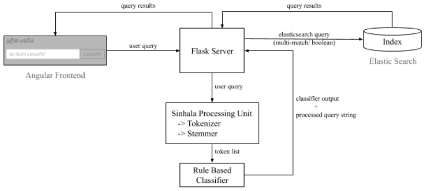
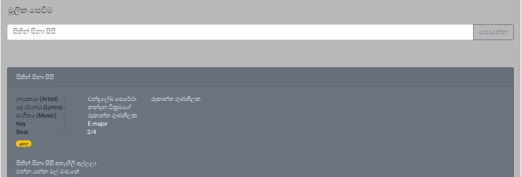
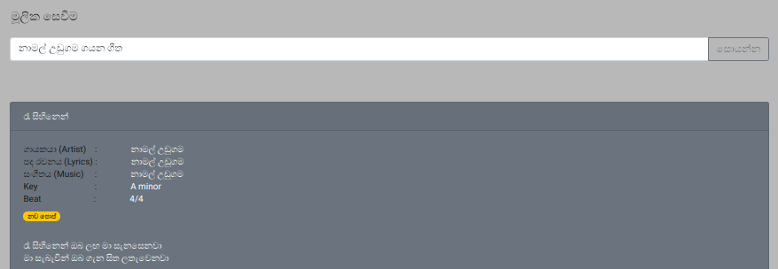
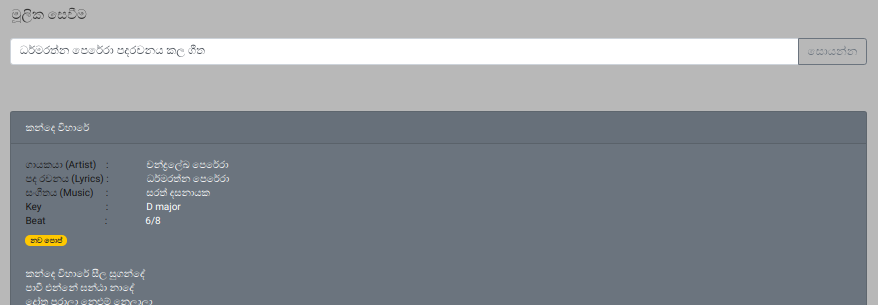
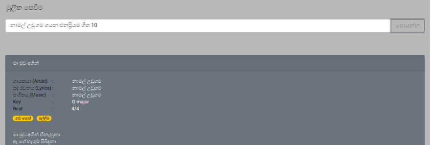
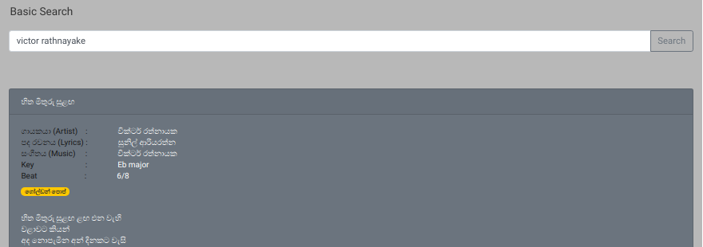
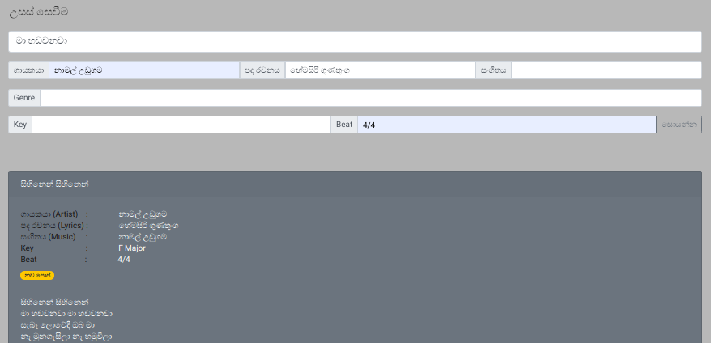

# Sinhala Lyrics Search Engine
This is a simple lyrics search engine created using Elasticsearch for sinhala songs. The project consists of a Angular frontend and a Python Flask backend server.



## Getting Started
### Setting Up Elasticsearch
1. Download and run [Elasticsearch](https://www.elastic.co/downloads/elasticsearch).
  > This project was made using Elasticsearch version 7.7.1. Query formats may get changed in future versions.
2. Install [ICU Analysis](https://www.elastic.co/guide/en/elasticsearch/plugins/current/analysis-icu.html) plugin.
3. Optionally install [Kibana](https://www.elastic.co/downloads/kibana) for below query operations.

### Setting Up the Index
> Alternatively, you can restore the index from the provided elasticsearch snapshot in the `es_snapshots/` folder [See more on snapshot and restore](https://www.elastic.co/guide/en/elasticsearch/reference/current/snapshot-restore.html)

1. Create an index named `sinhala_lyrics_tokenized` in the Elasticsearch and execute below queries.
```
PUT /sinhala_lyrics_tokenized
{
  "settings": {
    "index": {
      "analysis": {
        "analyzer": {
          "sinhalaAnalyzer": {
            "type": "custom",
            "tokenizer": "icu_tokenizer",
            "filter": ["edgeNgram"],
            "char_filter": ["dotFilter"]
          }
        },
        "filter": {
          "edgeNgram": {
            "type": "edge_ngram",
            "min_gram": 2,
            "max_gram": 50,
            "side": "front"
          }
        },
        "char_filter": {
          "dotFilter": {
            "type": "mapping",
            "mappings": ". => \\u0020"
          }
        }
      }
    }
  }
}
```
```
PUT sinhala_lyrics_tokenized/_mappings/
{
  "properties": {
    "artist": {
      "type": "text",
      "fields": {
        "keyword": {
          "type": "keyword",
          "ignore_above": 256
        }
      },
      "analyzer": "sinhalaAnalyzer",
      "search_analyzer": "standard"
    },
    "beat": {
      "type": "text",
      "fields": {
        "keyword": {
          "type": "keyword",
          "ignore_above": 256
        }
      }
    },
    "genre": {
      "type": "text",
      "fields": {
        "keyword": {
          "type": "keyword",
          "ignore_above": 256
        }
      },
      "analyzer": "sinhalaAnalyzer",
      "search_analyzer": "standard"
    },
    "key": {
      "type": "text",
      "fields": {
        "keyword": {
          "type": "keyword",
          "ignore_above": 256
        }
      }
    },
    "lyric": {
      "type": "text",
      "fields": {
        "keyword": {
          "type": "keyword",
          "ignore_above": 256
        }
      },
      "analyzer": "sinhalaAnalyzer",
      "search_analyzer": "standard"
    },
    "lyricWriter": {
      "type": "text",
      "fields": {
        "keyword": {
          "type": "keyword",
          "ignore_above": 256
        }
      },
      "analyzer": "sinhalaAnalyzer",
      "search_analyzer": "standard"
    },
    "musicDirector": {
      "type": "text",
      "fields": {
        "keyword": {
          "type": "keyword",
          "ignore_above": 256
        }
      },
      "analyzer": "sinhalaAnalyzer",
      "search_analyzer": "standard"
    },
    "shares": {
      "type": "long"
    },
    "songName": {
      "type": "text",
      "fields": {
        "keyword": {
          "type": "keyword",
          "ignore_above": 256
        }
      },
      "analyzer": "sinhalaAnalyzer",
      "search_analyzer": "standard"
    },
    "url": {
      "type": "text",
      "fields": {
        "keyword": {
          "type": "keyword",
          "ignore_above": 256
        }
      }
    },
    "views": {
      "type": "long"
    }
  }
}

```
2. Download [Sinhala Lyrics Corpus](https://github.com/ThaminduDilshan/Sinhala-Lyrics-Corpus) and add documents to the created index using the [Bulk API](https://www.elastic.co/guide/en/elasticsearch/reference/current/docs-bulk.html).

> You may use Kibana/ Sense or any other option for above query operations.

### Setting Up the Python Server
1. Install python and pip version 3
2. Install required python packages by running the following command in the project home directory. `$ pip install -r requirements.txt`
3. Download and setup [SinLing](https://github.com/nlpc-uom/Sinling). You may have to append project path to your path environment variable.
4. Configure the index name and Elasticsearch host:port details in `/python-backend-server/main.py` file.
```
index_name = 'sinhala_lyrics_tokenized'
es = Elasticsearch('localhost', port=9200)
```

### Setting Up Angular Front-end
1. Download and install required node packages by running `npm install` in the `/lyrics-search-engine/` directory.

## Running the Project
1. Run the Elasticsearch instance.
2. Run the Python backend server by executing `python main.py` in the `/python-backend-server/` directory.
3. Run the Angular web app by executing `ng serve --open` command in the `/lyrics-search-engine/` directory.

## Basic Usage Examples
* Search by a song name.


* Search by an artist name.


* Search by the lyric writer.


* Search for popular songs.


* Search using the English language. Searching song names and lyrics in English is not yet supported (You have to switch the language to English from the UI).


* Perform an advanced search with more options.


## Additional Details
The project utilizes the below query types in Elasticsearch.
* [Multi-match query](https://www.elastic.co/guide/en/elasticsearch/reference/current/query-dsl-multi-match-query.html) with certain fields boosted
* [Boolean query](https://www.elastic.co/guide/en/elasticsearch/reference/current/query-dsl-bool-query.html)

Aditionally, below query options were also used.
* [Terms Aggregation](https://www.elastic.co/guide/en/elasticsearch/reference/current/search-aggregations-bucket-terms-aggregation.html)
* [Sort](https://www.elastic.co/guide/en/elasticsearch/reference/6.8/search-request-sort.html)

This project uses the `Sinhala Tokenizer` from [SinLing](https://github.com/nlpc-uom/Sinling), a language processing tool for Sinhala language.

Also, the project uses a `Sinhala Stemmer` from 'https://github.com/e11379dana/SinhalaStemming'.

English to Sinhala translations are done using the [translate](https://pypi.org/project/translate/) python package.
